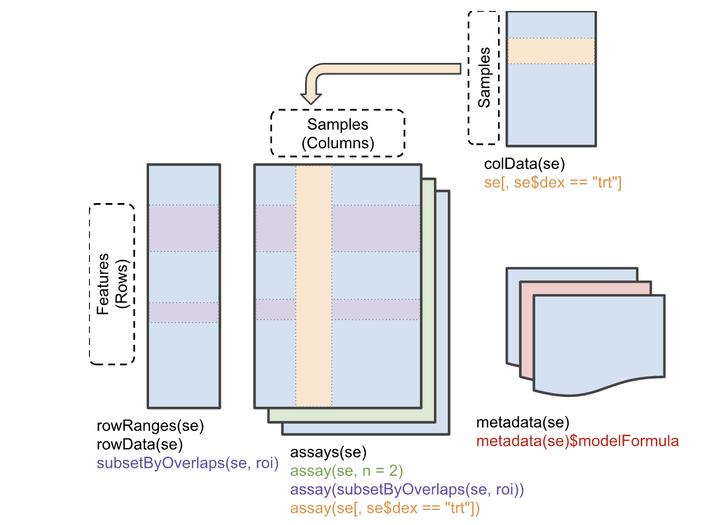
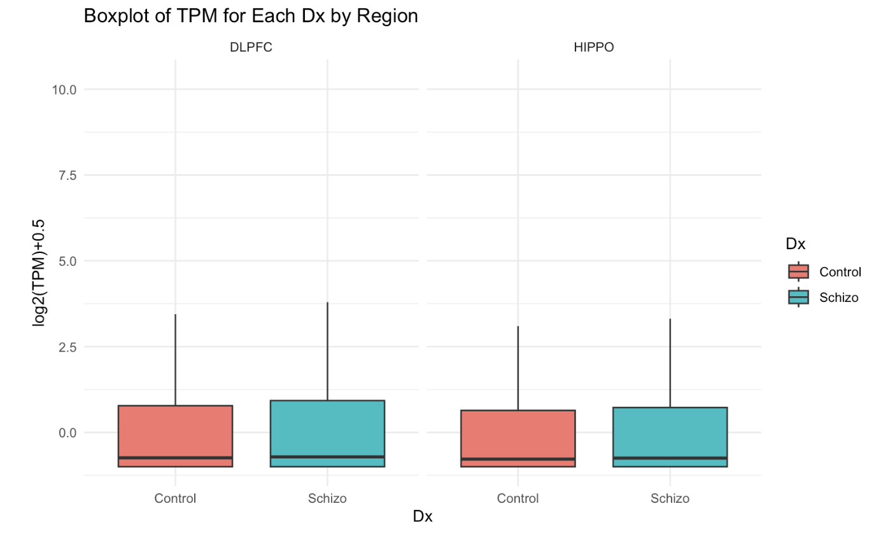

```{r setup, include = FALSE}
knitr::opts_chunk$set(
    collapse = TRUE,
    comment = "#>",
    crop = NULL ## Related to https://stat.ethz.ch/pipermail/bioc-devel/2020-April/016656.html
)
```


```{r vignetteSetup, echo=FALSE, message=FALSE, warning = FALSE}
## Track time spent on making the vignette
startTime <- Sys.time()

## Bib setup
library("RefManageR")

## Write bibliography information
bib <- c(
    R = citation(),
    BiocStyle = citation("BiocStyle")[1],
    knitr = citation("knitr")[1],
    RefManageR = citation("RefManageR")[1],
    rmarkdown = citation("rmarkdown")[1],
    sessioninfo = citation("sessioninfo")[1],
    testthat = citation("testthat")[1],
    qsvaRPkgDemo = citation("qsvaRPkgDemo")[1],
    SummarizedExperiment = citation("SummarizedExperiment")[1],
    tidySummarizedExperiment = citation("tidySummarizedExperiment")[1],
    tidyverse = citation("tidyverse")[1],
    ComplexHeatmap = citation("ComplexHeatmap")[1],
    colorRamp2 = citation("colorRamp2")[1],
    magrittr = citation("magrittr")[1],
    purrr = citation("purrr")[1],
    dplyr = citation("dplyr")[1],
    limma = citation("limma")[1],
    variancePartition = citation("variancePartition")[1],
    qsvaR = citation("qsvaR")[1],
    Jaffe2017 = RefManageR::BibEntry(
        "article",
        key = "Jaffe2017",
        author = " A. E. Jaffe and R. Tao and  A. L.  Norris and M. Kealhofer  and A. Nellore and J. H. Shin and K. Dewey and J. Yankai  and M. Hyde Thomas  and Joel E. Kleinman and Richard E. Straub and Jeffrey T. Leek and Daniel R. Weinberger",
        doi = "10.1073/pnas.1617384114",
        issn = "10916490",
        issue = "27",
        journal = "Proceedings of the National Academy of Sciences of the United States of America",
        keywords = "Differential expression analysis,RNA quality,RNA sequencing,Statistical modeling",
        month = "7",
        pages = "7130-7135",
        pmid = "28634288",
        publisher = "National Academy of Sciences",
        title = "QSVA framework for RNA quality correction in differential expression analysis",
        volume = "114",
        year = "2017"
    ),
    ColladoTorres2019 = RefManageR::BibEntry("article",
        key = "ColladoTorres2019",
        author = "L. Collado-Torres and Emily E. Burke and A. Peterson and J. H. Shin and Richard E. Straub and Anandita Rajpurohit and Stephen A. Semick and William S. Ulrich and Amanda J. Price and Cristian Valencia and Ran Tao and Amy Deep-Soboslay and Thomas M. Hyde and Joel E. Kleinman and Daniel R. Weinberger and Andrew E. Jaffe",
        doi = "10.1016/j.neuron.2019.05.013",
        issn = "10974199",
        issue = "2",
        journal = "Neuron",
        keywords = "RNA-seq,TWAS,brain,development,eQTL,human,regional coherence,schizophrenia",
        month = "7",
        pages = "203-216.e8",
        pmid = "31174959",
        publisher = "Cell Press",
        title = "Regional Heterogeneity in Gene Expression, Regulation, and Coherence in the Frontal Cortex and Hippocampus across Development and Schizophrenia",
        volume = "103",
        year = "2019"
    ),
    Law2020 = RefManageR::BibEntry(
        "article",
        key = "Law2020",
        author = "W. Law Charity and K. Smyth Gordon and E. Ritchie Matthew and Kathleen Zeglinski and Xueyi Dong and Monther Alhamdoosh ",
        doi = "10.12688/f1000research.27893.1",
        issn = "1759796X",
        journal = "F1000Research",
        keywords = "Contrast matrix,Design matrix,Gene expression analysis,Model matrix,Statistical models",
        pmid = "33604029",
        publisher = "F1000 Research Ltd",
        title = "A guide to creating design matrices for gene expression experiments",
        volume = "9",
        year = "2020"
    )
)
```

```{r, echo=FALSE, message=FALSE, include = FALSE}
Citep(bib[["Jaffe2017"]])
Citep(bib[["ColladoTorres2019"]])
Citep(bib[["Law2020"]])
```

# Introduction

Postmortem brain tissue is a valuable resource for studying the human brain and understanding various neurological and psychiatric disorders. However, the quality of postmortem brain tissue can be significantly affected by degradation, which can occur due to various factors such as the time elapsed since death (postmortem interval), the conditions in which the body was stored, and the method of tissue preservation.

Therefore, it's crucial to remove or at least minimize the effect of degradation in postmortem brain tissue to ensure the accuracy and reliability of research findings. This can be achieved through various methods, such as optimizing the conditions for tissue storage and preservation, using appropriate controls, and using statistical methods to correct for the effects of degradation.

This method has been described in the initial qSVA framework paper `r Citep(bib[["Jaffe2017"]], .opts = list(max.names = 1))`.

This is a basic example which shows how to obtain the quality surrogate variables (qSVs) for BrainSeq Phase 2.

# R/Bioconductor packages used

```{r loadPackages, warning=FALSE, message=FALSE}
library(SummarizedExperiment)
library(tidySummarizedExperiment)
library(tidyverse)
library(variancePartition)
library(ComplexHeatmap)
library(colorRamp2)
library(ggplot2)
library(magrittr)
library(purrr)
library(dplyr)
library(limma)
library(qsvaR)
```

# Time Outline
|            Activity            | Time |
|:------------------------------:|:----:|
| Introduction to qsvaR (slides) | 10m  |
| Data overview                  | 5m   |
| Limma and qsvaR                | 20m  |

Total: a 35 minute session.

# Workshop goals

During the workshop, we will provide a step-by-step explanation of the qsvaR and apply it to BrainSeq Phase 2 dataset. We will describe how using qsvaR can improve the reproducibility of differential expression analyses across datasets.

# BrainSeq Phase 2 Dataset

For illustrative purposes, we'll use the BrainSeq Phase 2 data at the transcript level `r Citep(bib[["ColladoTorres2019"]], .opts = list(max.names = 1))`. This dataset is RiboZero RNA-seq data for 900 samples across both the dorsolateral prefrontal cortex (DLPFC) and the hippocampus (HIPPO) for 551 individuals (286 affected by schizophrenia disorder: SCZD) . Visit [here](https://eqtl.brainseq.org/phase2/) for more details.

## Load the data

The BrainSeq Phase 2 data at the transcript level resides in a `RangedSummarizedExperiment` (RSE) object called `rse_tx`. It has been obtained after running the `SPEAQeasy` pipeline. To have a better understanding of how the pipeline works please attend the workshop that will be presented by Lieber collegues at the [BioC2023](https://bioc2023.bioconductor.org/abstracts/paper24/)

```{r loadData}
options(timeout = 400)
## Load the rse_tx object
load(url("https://s3.us-east-2.amazonaws.com/libd-brainseq2/rse_tx_unfiltered.Rdata"), verbose = T)

## General overview of the object
rse_tx
```

This is a `SummarizedExperiment` object but it is evaluated as a tibble. So it is fully compatible both with `SummarizedExperiment` and tidyverse APIs.

## Background
### SummarizedExperiment

The `SummarizedExperiment` package contains two classes: `SummarizedExperiment` and `RangedSummarizedExperiment`.

`RangedSummarizedExperiment` is a subclass of the SummarizedExperiment class, meaning it inherits all the features and functionalities of its parent class.

<div class="alert alert-info">
  <strong>Note:</strong> The primary difference is that the rows of a `RangedSummarizedExperiment` object represent genomic ranges of interest, rather than a `DataFrame` of features.
</div>

`RangedSummarizedExperiment` objects use a `GRanges` or `GRangesList` object to represent genomic ranges. These objects store information about genomic coordinates, genomic features, and annotations for the ranges of interest. The `rowRanges()` function allows you to access and manipulate the `GenomicRanges` information within a `RangedSummarizedExperiment` object.

The following graphic displays the class geometry and highlights the vertical (column) and horizontal (row) relationships.

{width=400%}

### Sample Information

The sample information in `colData(rse_tx)` contains the following main variables:

- `SAMPLE_ID` : is the name of the sample.

- `ERCCsumLogErr` : a summary statistic quantifying overall difference of expected and actual ERCC concentrations for one sample. 

- `numReads` : Total number of reads in fastq file.

- `numMapped` :	Number of reads that were aligned by HISAT2 to the reference genome.

- `numUnmapped` :	Number of reads that did not align to the reference genome.

- `overallMapRate` : Proportion of total reads mapped (numMapped / numReads).

- `concordMapRate` : If library is paired-end, percentage of read pairs that mapped concordantly.

- `overallMapRate`: the decimal fraction of reads which successfully mapped to the reference genome (i.e.numMapped/numReads). 

- `totalMapped`: the number of reads which successfully mapped to the canonical sequences in the reference genome (excluding mitochondrial chromosomes).

- `mitoMapped`: the number of reads which successfully mapped to the mitochondrial chromosome. 

- `mitoRate` : the decimal fraction of reads which mapped to the mitochondrial chromosome, of those which map at all (i.e.mitoMapped/ (totalMapped+mitoMapped)).

- `totalAssignedGene` : the decimal fraction of reads assigned unambiguously to a gene (including mitochondrial genes), with featureCounts of those in total.

- `rRNA_rate` : the decimal fraction of reads assigned to a gene whose type is 'rRNA', of those assigned to any gene.

- `RNum` : is the identifier for the RNAseq experiment and is related to the Sample ID.

- `BrNum` : stands for Brain Number. It likely refers to a unique identifier assigned to each brain (or brain sample) examined in the study.

- `Region` : refers to a specific region of the brain from which the sample was taken.

- `RIN` : refers to RNA Integrity Number. It's a measure of the quality of the RNA samples used in the study. A higher RIN indicates higher quality, and thus more reliable, RNA.

- `Age` : refers to the age of the donors from which the samples were taken.

- `Sex` : refers to the sex of the donors from which the samples were taken. if the sample comes from a female (F) or a male (M) donor.

- `Race` : refers to the race of the donors from which the samples were taken.

- `Dx` : refers to the diagnosis of the donors from which the samples were taken.


### Data normalization

We would like to use the `Transcripts Per Million (TPM)` or `tpm` data. The `rse_tx` object contains the following `tpm` normalized assays:

```{r, eval=FALSE}
assays(rse_tx)
```

`tpm`: normalized read counts of the 19,8093 genes across 900 samples.

<div class="alert alert-info">
  <strong>Note:</strong> `Transcripts Per Million (TPM)` is a normalization method for RNA-seq data that facilitates comparisons both within and between samples. It adjusts for `gene length` and `sequencing depth`, making it a helpful measure for relative gene expression.
</div>

There are many ways to access the `tpm` data. Below some of them:

```{r Gettpm, eval=FALSE}
# Extract the first element from the list of assays in the SummarizedExperiment object
# This assumes that the first element in the list of assays is the one you are interested in
assays(rse_tx) %>% extract2(1)

# Another way of extracting the first element from the list of assays in the SummarizedExperiment object
# Here, 'tpm' is assumed to be the name of the first assay
assays(rse_tx)$tpm

# Yet another way of extracting the first element from the list of assays in the SummarizedExperiment object
# The simplify() function tries to simplify the result to a vector or matrix if possible
# The first() function extracts the first element of the simplified result
assays(rse_tx) %>%
    simplify() %>%
    first() %>%
    head()
```

### Data distribution

Let's have a look at the distribution of the `tpm` assay.
Before we have to reformat the data as follows:

```{r TransformData, eval=FALSE}
options(timeout = 400)
# Transform 'tpm' data to a long format with 'Transcript', 'Sample', and 'TPM' columns
tpm_tb <- log2(assays(rse_tx)$tpm + 0.5) %>%
    as.data.frame() %>%
    rownames_to_column(var = "Transcript") %>%
    pivot_longer(
        cols = -Transcript,
        names_to = "Sample",
        values_to = "TPM"
    )

# Extract 'RNum', 'Region', and 'Dx' from 'rse_tx', convert to tibble
colData_tb <- colData(rse_tx) %>%
    as.data.frame() %>%
    dplyr::select(RNum, Region, Dx) %>%
    as_tibble()

# Join 'tpm_tb' with 'colData_tb' based on 'Sample' and 'RNum'
tpm_tb <- tpm_tb %>%
    dplyr::left_join(colData_tb, by = c("Sample" = "RNum"))

# Calculate mean TPM for each Dx and Region
mean_tpm <- tpm_tb %>%
    group_by(Dx, Region) %>%
    summarise(
        mean_TPM = mean(TPM, na.rm = TRUE),
        .groups = "drop" # This drops the grouping
    )
```

Now we can plot the data. Let's have a look at the boxplots, histograms and density plots. We'll display only the boxplots.

```{r PlotData, eval=FALSE}
# Create boxplot for first 100,000 rows, without outliers, split by Dx and Region
p1 <- tpm_tb %>%
    slice(1:100000) %>%
    ggplot(aes(x = Dx, y = TPM, fill = Dx)) +
    geom_boxplot(outlier.shape = NA) +
    facet_wrap(~Region) +
    theme_minimal() +
    labs(title = "Boxplot of TPM for Each Dx by Region", x = "Dx", y = "log2(TPM)+0.5")

# Create a histogram of TPM for each Dx
p2 <- tpm_tb %>%
    slice(1:100000) %>%
    ggplot(aes(x = TPM, fill = Dx)) +
    geom_histogram(alpha = 0.5, bins = 30, position = "identity") +
    facet_wrap(~Dx) +
    theme_minimal() +
    labs(title = "Histogram of TPM for Each Dx", x = "log2(TPM)+0.5", y = "Count")

# Create a density plot of TPM for each Dx
p3 <- tpm_tb %>%
    slice(1:100000) %>%
    ggplot(aes(x = TPM, fill = Dx)) +
    geom_density(alpha = 0.5) +
    facet_wrap(~Dx) +
    theme_minimal() +
    labs(title = "Density Plot of TPM for Each Dx", x = "log2(TPM)+0.5", y = "Density")

p1
```

Here the results of the boxplots.

{width=400%}

### Correlation Analysis

In essence, our objective is not just to recognize the factors contributing to expression variation, but to accurately measure their individual impacts. 

Understanding these relationships will allow us to develop a more accurate and reliable predictive model. 

Thus, evaluating the `correlation` among sample variables is an imperative step in our analysis. 


The presence of `highly correlated` variables can significantly **impact** the `robustness` of our model, creating **unstable estimates** of variance fractions. 

```{css, echo=FALSE}
<style>
p.comment {
background-color: #DBDBDB;
padding: 10px;
border: 1px solid black;
border-radius: 5px;
font-family: sans-serif;
}
</style>

</style>
<p class="comment">
❓ ***Why assessing  correlation is so important?*** 
When two or more variables are highly correlated, meaning that one can be linearly predicted from the others with a substantial degree of accuracy, they essentially contain `redundant information`. This redundancy can lead to what is known as `multicollinearity`, a situation that can greatly reduce the performance of the model and lead to overfitting.

Therefore, assessing correlation enables us to `prevent multicollinearity`, ensuring a more accurate and reliable analysis.
</p>
```

Let's first unlist RIN, mitoMapped and totalAssignedGene to make it possible to work with these variables.

```{r unlistData}
colData(rse_tx)$RIN <- as.numeric(unlist(colData(rse_tx)$RIN))
colData(rse_tx)$mitoMapped <- unlist(map(colData(rse_tx)$mitoMapped, 1))
colData(rse_tx)$totalAssignedGene <- unlist(map(colData(rse_tx)$totalAssignedGene, 1))
colData(rse_tx)$rRNA_rate <- unlist(map(colData(rse_tx)$rRNA_rate, 1))
colData(rse_tx)$numReads <- unlist(map(colData(rse_tx)$numReads, 1))
colData(rse_tx)$numMapped <- unlist(map(colData(rse_tx)$numMapped, 1))
colData(rse_tx)$numUnmapped <- unlist(map(colData(rse_tx)$numUnmapped, 1))
colData(rse_tx)$overallMapRate <- unlist(map(colData(rse_tx)$overallMapRate, 1))
colData(rse_tx)$concordMapRate <- unlist(map(colData(rse_tx)$concordMapRate, 1))
colData(rse_tx)$totalMapped <- unlist(map(colData(rse_tx)$totalMapped, 1))
colData(rse_tx)$mitoRate <- unlist(map(colData(rse_tx)$mitoRate, 1))
colData(rse_tx)$ERCCsumLogErr <- unlist(map(colData(rse_tx)$ERCCsumLogErr, 1))
```


We'll be using the `canCorPairs()` from the `variancePartition` package which performs canonical correlation analysis (CCA) between pairs of variables.

In the context of the `variancePartition` package, the `canCorPairs()` computes the `canonical correlations` between each pair of variables specified in the formula argument.

<div class="alert alert-info">
  <strong>Note:</strong> canCorPairs returns correlation values between 0 and 1. Canonical Correlation Analysis (CCA) returns sqrt(mean(rho^2)), which is the fraction of the maximum possible correlation. When comparing a two vectors, or a vector and a matrix, this gives the save value as the absolute correlation. When comparing two sets of categorical variables, this is equivalent to Cramer's V statistic.
</div>

```{r PlotHeatmap}
formula <- ~ Dx + RIN + Age + Sex + Race + mitoMapped + overallMapRate + mitoRate + rRNA_rate + concordMapRate + totalMapped + totalAssignedGene + Region
correlation_matrix <- canCorPairs(formula, colData(rse_tx))

# Create the heatmap
# Create a color function from green to purple
color_func <- colorRamp2(c(-1, 0, 1), c("darkgreen", "white", "purple"))

# Create the heatmap
Heatmap(correlation_matrix,
    name = "Correlation", # Title for the color key
    show_row_names = TRUE, # Show row names
    show_column_names = TRUE, # Show column names
    cluster_rows = FALSE, # Do not cluster rows
    cluster_columns = FALSE, # Do not cluster columns
    cell_fun = function(j, i, x, y, width, height, fill) {
        grid.text(sprintf("%.2f", correlation_matrix[i, j]), x, y,
            gp = gpar(fontsize = 10)
        )
    },
    col = color_func, # Use the custom color function
    heatmap_legend_param = list(
        title = "Correlation", # legend title
        color_bar = "continuous", # type of color bar
        legend_direction = "horizontal" # direction of legend
    )
)
```

The `cell_fun` function customizes the display of each cell in the heatmap by adding the correlation value as text inside the cell with a specific format and font size.

From the heatmap we can see that there's a high correlation between `mitoMapped` and `totalAssignedGene`. We can't say if it's a positive or negative correlation since it's an  absolute correlation. 

<div class="alert alert-info">
  <strong>Note:</strong> One of the strategies to address multicollinearity is removing some of the highly correlated independent variables. So we have to keep `mitoMapped` or `totalAssignedGene` in our model. 
</div>

# Analysis 
## qsvaR: Quality Surrogate Variable Analysis 

Here's a general outline of how qSVA can be used to adjust for degradation in postmortem brain tissue:

1. **Identify Surrogate Variables**: The first step in qSVA is to identify surrogate variables that capture the `unwanted variation` in the data. These variables are often not of primary interest in the study but can significantly affect the results.

2. **Estimate the Effect of Surrogate Variables**: The next step is to estimate the effect of the surrogate variables on the data. This is typically done using a statistical model that includes the surrogate variables as covariates. The coefficients for the surrogate variables in this model represent their effect on the data.

3. **Adjust the Data for the Effect of Surrogate Variables in the DE analysis**: Once the effect of the surrogate variables has been estimated, this effect can be removed from the data. This is typically done by subtracting the estimated effect of the surrogate variables from the data. The resulting adjusted data should be free of the unwanted variation due to degradation.

4. **Perform the Primary Analysis on the Adjusted Data**: Once the data has been adjusted for the effect of the surrogate variables, the primary analysis can be performed on the adjusted data. This analysis should yield results that are not confounded by the unwanted variation due to degradation.

### Get the degradation transcripts

One of the first steps of the `qSVA` is to get the degradation transcripts to estimate their effects. 

We'll need to choose one of the three models to get those transcripts. Here the names `cell_component`, `top1500`, and `standard` refer to models that were determined to be effective in removing degradation effects.

### qsvaR models

#### The standard model

The `standard` model involves taking the union of the `top 1000` transcripts associated with degradation from the interaction model and the main effect model.

#### The top1500 model

The `top1500` model is the same as the "standard" model except the union of the `top 1500` genes associated with degradation is selected.

#### The cell component model

The `cell_component` model, involved `deconvolution` of the degradation matrix to determine the proportion of cell types within our studied tissue. These proportions were then added to our `model.matrix()` and the union of the top 1000 transcripts in the interaction model, the main effect model, and the cell proportions model were used to generate this model of qSVs. **It's the most effective of our models**.

### Run qSVA step by step

After loading the `rse_tx` object we subset for the transcripts associated with degradation. 

In this example we will choose `cell_component` when using the `getDegTx()` and `select_transcripts()` functions. `getDegTx()` is used to select a specific set of transcripts from a given experiment, and provides a warning if the mean expression level of these transcripts is low.

```{r GetDegTx}
## Next we get the degraded transcripts for qSVA from the "cell_component"
## model
DegTx <- getDegTx(rse_tx, type = "cell_component")
dim(DegTx)
```

The `getPCs()` applies PCA using the `prcomp` function.

```{r GetPCs}
## Now we can compute the Principal Components (PCs) of the degraded transcripts
pcTx <- getPCs(DegTx, "tpm")
head(pcTx$x)[, 1:10]
```

We use a model matrix that accounts for relevant variables `r Citep(bib[["Law2020"]], .opts = list(max.names = 1))`. We include variables such as Age, Sex, Race, and Region in this model. Our dataset, `DegTx`, a `RangedSummarizedExperiment` object, is used as the `rse_tx` input.

<div class="alert alert-info">
  <strong>Note:</strong> The model.matrix() function takes a formula and a data frame (or similar object) and returns the design matrix.
  
model.matrix() will automatically create dummy variables for each level of the factor. Dummy variables are binary (0/1) variables that indicate the presence of a categorical level for each observation.
</div>

The `model.matrix()` takes the variables in the formula format:

`model.matrix([target] ~ [predictor / features], data = [data source])`

This part is called a formula: 
`~ Dx + Age + Sex + Race + Region`

The tilde (~) can be read as `is modeled as`. The variables on the right side of the tilde are the predictor variables (or features). 

In this case, Dx, Age, Sex, Race, and Region are your `predictors`.

Let's understand this step by step:

```{r Modelmatrix}
# Creates a model matrix for regression analysis using the predictors Dx, Age, Sex, Race, and Region from the column data of the rse_tx object.
mod <- model.matrix(~ Dx + Age + Sex + Race + Region,
    data = colData(rse_tx)
)

# check the names of the columns in the mod matrix
colnames(mod)
```

The `k_qsvs()` function is employed to determine the required number of Principal Components (PCs) needed to capture the underlying variation in our data.

```{r kQsvs}
# Get the number of qsvs
set.seed(20230703)
k <- k_qsvs(DegTx, mod, "tpm")
print(k)
```

### Run qSVA using the qSVA wrapper function

You can simplify the process by utilizing our integrated function, `qSVA`. This wrapper function conveniently combines all previously mentioned functions, streamlining the analysis into a single step.

```{r qSVA}
## Example use of the wrapper function qSVA()
set.seed(20230703)
qsva_pcs_cc <- qSVA(rse_tx, type = "cell_component", mod = mod, assayname = "tpm")
dim(qsva_pcs_cc)
```

## Differential Expression using limma

Before jumping to the differential expression analysis we have to add the qSVs to our statistical model by using the `cbind()`. 

`mod_qSVA` includes both our original model and the qSVs. The qSVs adjust for the degradation effect.

```{r AddqSVs}
## Add the qSVs to our statistical model
mod_qSVA <- cbind(
    mod,
    qsva_pcs_cc
)
```

`limma` fits a so-called linear model. [Here](https://bioconductor.org/packages/release/bioc/vignettes/limma/inst/doc/usersguide.pdf) the limma User's Guide from the limma bioconductor webpage.

In the context of limma, each gene's expression level is modeled as a linear combination of the experimental factors, with some added noise or error term.

The `lmFit()` function fits a separate linear model to each gene (or transcript, in this case), and the result (fitTx) is an object that contains the fitted model coefficients and other statistics for each gene.

After fitting the model, `eBayes()` is used to compute `empirical Bayes statistics` for differential expression. The function applies a shrinkage technique to the standard errors, improving the stability of the estimates, particularly when the number of samples is small. 

The object eBTx that results from the `eBayes()` call is a fitted model object that contains several components, including `coefficients`, `standard errors`, `t-statistics`, `p-values`, and more.

The steps are the following:
```{r LimmaDEA}
## Extract the transcript expression values and put them in the
## log2(TPM + 0.5) scale
txExprs <- log2(assays(rse_tx)$tpm + 0.5)

## Run the standard linear model for differential expression
fitTx <- lmFit(txExprs, mod_qSVA)
eBTx <- eBayes(fitTx)
```

In this part above of the code, we are running a linear model for differential expression analysis using the `lmFit()` from the `limma` package in R. 

The function takes two main arguments: the matrix of expression values (txExprs) and the design matrix (mod_qSVA). 

The design matrix specifies the linear model that you're fitting to the data. In this case, mod_qSVA includes the variables of interest and the qSVs.

<div class="alert alert-info">
  <strong>Note:</strong> The `colnames(eBTx)` function will return the names of the columns of the coefficients matrix in the eBTx object. Each column of this matrix corresponds to a coefficient in the linear model, which in turn corresponds to a comparison of interest in your experiment.
</div>

```{r Getcomp}
# Get the comparison names from the fitted model 'eBTx'
colnames(eBTx)
```

Let's extract the differential expression results.

```{r topTable}
## Extract the differential expression results
sigTx <- topTable(eBTx,
    coef = "DxSchizo", # test for differential expression with respect to the "DxSchizo" coefficient.
    p.value = 1, # all genes will be returned, regardless of their p-values
    number = nrow(rse_tx) # all genes to be returned
)
```

`coef = "DxSchizo"` specifies the model coefficient of interest. The `topTable()` will return results for this specific term.

Let's explore the top results.

```{r topResults}
## Explore the top results
head(sigTx)
```

Here's a breakdown of what each column in this output represents:

- **logFC (Log Fold Change)**: This represents the log2 fold-change for the differential expression between two conditions. A positive value indicates higher expression in the second condition, while a negative value indicates higher expression in the first condition. For example, a logFC of -0.07856532 for ENST00000553142.5 means this transcript has lower expression in the second condition compared to the first.

- **AveExpr (Average Expression)**: This is the average log2 expression level of the gene across all samples. It provides a general idea of how abundantly the gene is expressed.

- **t (t-statistic)**: This is the t-statistic from the differential expression test. It is a measure of how different the expression levels of the gene are between the two conditions, in units of standard error. 

<div class="alert alert-info">
  <strong>Note:</strong> A higher absolute value of the t-statistic means the gene's expression is more significantly different between the conditions.
</div>

- **P.Value (p-value)**: This is the p-value from the differential expression test. It quantifies the statistical evidence against the null hypothesis that the gene's expression levels are the same in the two conditions. 

<div class="alert alert-info">
  <strong>Note:</strong> A lower p-value suggests stronger evidence against the null hypothesis.
</div>

- **adj.P.Val (Adjusted p-value)**: This is the p-value adjusted for multiple testing using the method of Benjamini and Hochberg, also known as the false discovery rate (FDR). It helps control for false positives when testing multiple hypotheses (genes) at once. 

<div class="alert alert-info">
  <strong>Note:</strong> Typically, genes with an adjusted p-value (or FDR) less than 0.05 or 0.01 are considered statistically significantly differentially expressed.
</div>

- **B (B-statistic or log-odds of differential expression)**: This is the B-statistic from the empirical Bayes analysis, which can be interpreted as the log-odds that the gene is differentially expressed. 

<div class="alert alert-info">
  <strong>Note:</strong> A higher B-statistic means the gene is more likely to be differentially expressed.
</div>

## Differential expression quality or DEqual plots

This R function, `DEqual`, is designed to compare `degradation t-statistics` with the `t-statistics` from a differential expression (DE) analysis in the human brain tissue. 

It takes as input a data frame (DE) containing differential expression results, such as those outputted by the limma package's topTable function. 

The function identifies the transcripts that are common between the `DE dataframe` and `degradation_tstats` from the qsvaR package and creates a new dataframe, common_data, which contains the `degradation t-statistics` and `DE t-statistics` for the common transcripts.

In this plot:

**Dark purple to blue bins**: These colors represent bins with a low number of data points. If a bin is dark purple or blue, it means there are relatively few transcripts with those particular DE and degradation t-statistics.

**Green to yellow bins**: These colors represent bins with a moderate number of data points. If a bin is green or yellow, it means there are a moderate number of transcripts with those particular DE and degradation t-statistics.

**Bright yellow bins**: These colors represent bins with a high number of data points. If a bin is bright yellow, it means there are many transcripts with those particular DE and degradation t-statistics.

```{r DEqualwithout}
## Generate a DEqual() plot using the model results without qSVs
DEqual(topTable(eBayes(lmFit(txExprs, mod)), coef = "DxSchizo", p.value = 1, number = nrow(rse_tx)))
```

The first plot reveals a correlation of **0.5** with the degradation experiment, even after adjusting for several common variables. Such a high correlation underscores the fact that degradation's signal remains significantly intertwined with our data. This can potentially introduce `confounding factors` in our differential expression analysis between the schizophrenia (SCZD) and neurotypical control groups.

<div class="alert alert-info">
  <strong>Note:</strong> In essence, the high correlation in the first plot could be masking the true differential gene expression between the case-control groups by mingling the degradation signal into the expression data. This emphasizes the need for adequate normalization, such as qSVA, to reduce such confounding factors and ensure a more accurate representation of the biological differences in gene expression.
</div>

For comparison, here is the DEqual() plot for the model with qSVs.

```{r DEqualwith}
## Generate a DEqual() plot using the model results with qSVs
DEqual(sigTx)
```

<br>

Conversely, in the second plot, the correlation stands at **-0.038**, suggesting a `minimal relationship` between degradation and the differential expression results. This indicates that the degradation effects have been effectively eliminated from the data, leading to a cleaner interpretation of the gene expression differences.

# Conclusion

In this workshop, we gained insights and practical knowledge on how to adjust for degradation in postmortem human brain tissue.

The results from the differential expression analysis with and without qSVA normalization shown in the two DEqual plots reveals the effectiveness of degradation effect removal.

The use of the qSVA effectively removes degradation effects. 

# Reproducibility

The `r Biocpkg("qsvaRPkgDemo")` package `r Citep(bib[["qsvaRPkgDemo"]])` was made possible thanks to:

* R `r Citep(bib[["R"]])`
* `r Biocpkg("BiocStyle")` `r Citep(bib[["BiocStyle"]])`
* `r CRANpkg("knitr")` `r Citep(bib[["knitr"]])`
* `r CRANpkg("RefManageR")` `r Citep(bib[["RefManageR"]])`
* `r CRANpkg("rmarkdown")` `r Citep(bib[["rmarkdown"]])`
* `r CRANpkg("sessioninfo")` `r Citep(bib[["sessioninfo"]])`
* `r CRANpkg("testthat")` `r Citep(bib[["testthat"]])`
* `r Biocpkg("SummarizedExperiment")` `r Citep(bib[["SummarizedExperiment"]])`
* `r Biocpkg("tidySummarizedExperiment")` `r Citep(bib[["tidySummarizedExperiment"]])`
* `r CRANpkg("tidyverse")` `r Citep(bib[["tidyverse"]])`
* `r CRANpkg("variancePartition")` `r Citep(bib[["variancePartition"]])`
* `r CRANpkg("ComplexHeatmap")` `r Citep(bib[["ComplexHeatmap"]])`
* `r CRANpkg("colorRamp2")` `r Citep(bib[["colorRamp2"]])`
* `r Biocpkg("limma")` `r Citep(bib[["limma"]])`
* `r CRANpkg("ggplot2")` `r Citep(bib[["ggplot2"]])`
* `r CRANpkg("dplyr")` `r Citep(bib[["dplyr"]])`
* `r CRANpkg("purrr")` `r Citep(bib[["purrr"]])`
* `r Githubpkg("jaffelab")` `r Citep(bib[["jaffelab"]])`
* `r Biocpkg("qsvaR")` `r Citep(bib[["qsvaR"]])`


This package was developed using `r BiocStyle::Biocpkg("biocthis")`.


Code for creating the vignette

```{r createVignette, eval=FALSE}
## Create the vignette
library("rmarkdown")
system.time(render("qsvaRPkgDemo.Rmd", "BiocStyle::html_document"))

## Extract the R code
library("knitr")
knit("qsvaRPkgDemo.Rmd", tangle = TRUE)
```

Date the vignette was generated.

```{r reproduce1, echo=FALSE}
## Date the vignette was generated
Sys.time()
```

Wallclock time spent generating the vignette.

```{r reproduce2, echo=FALSE}
## Processing time in seconds
totalTime <- diff(c(startTime, Sys.time()))
round(totalTime, digits = 3)
```

`R` session information.

```{r reproduce3, echo=FALSE}
## Session info
library("sessioninfo")
options(width = 120)
session_info()
```


# Bibliography

This vignette was generated using `r Biocpkg("BiocStyle")` `r Citep(bib[["BiocStyle"]])`
with `r CRANpkg("knitr")` `r Citep(bib[["knitr"]])` and `r CRANpkg("rmarkdown")` `r Citep(bib[["rmarkdown"]])` running behind the scenes.

Citations made with `r CRANpkg("RefManageR")` `r Citep(bib[["RefManageR"]])`.

```{r vignetteBiblio, results = "asis", echo = FALSE, warning = FALSE, message = FALSE}
## Print bibliography
PrintBibliography(bib, .opts = list(hyperlink = "to.doc", style = "html"))
```


